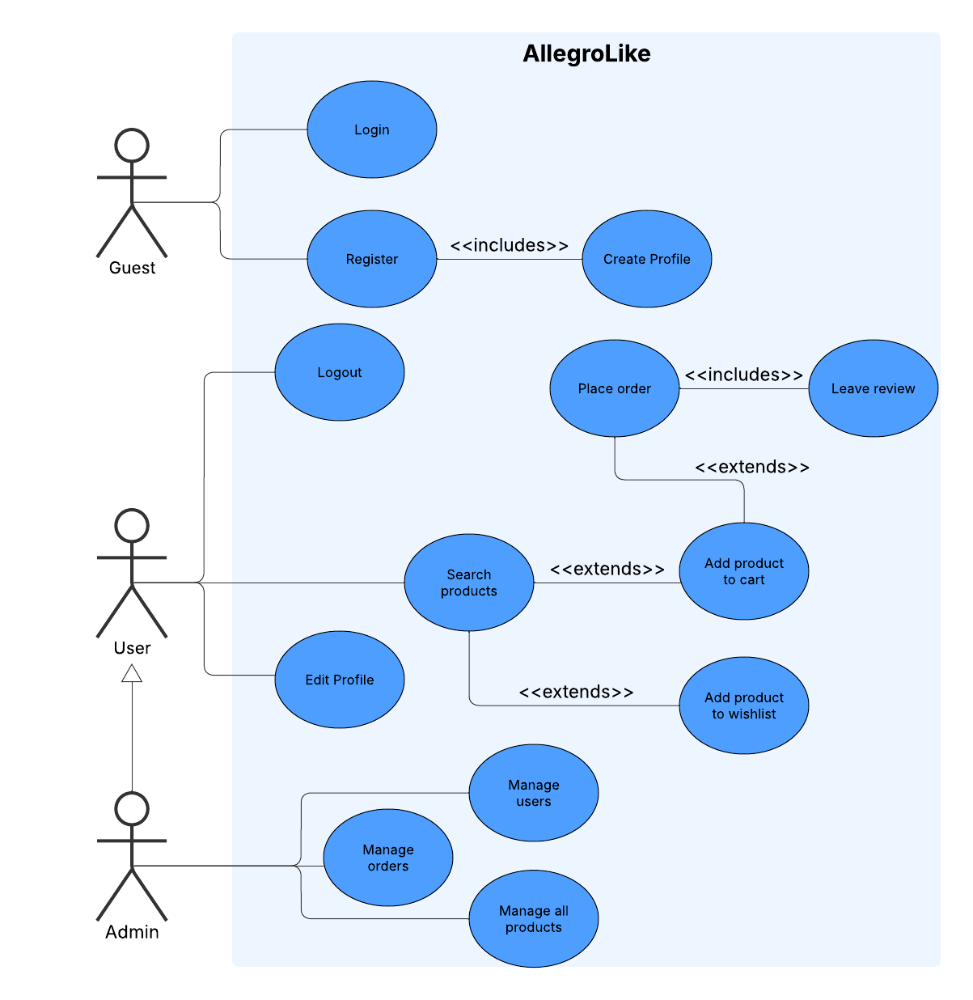

# 🛒 AllegroLike - Modern E-commerce Platform

<div align="center">



[](https://github.com/JakubGralinski/AllegroLikeClient/actions)
[](https://github.com/JakubGralinski/AllegroLikeServer/actions)

**A full-stack e-commerce platform built with React TypeScript frontend and Spring Boot backend**

[Features](#-features) • [Architecture](#-architecture) • [Setup](#-setup) • [Usage](#-usage) • [API](#-api-documentation) • [Contributing](#-contributing)

</div>

---

## 📋 Table of Contents

- [Overview](#-overview)
- [Features](#-features)
- [Architecture](#-architecture)
- [Technology Stack](#-technology-stack)
- [Project Structure](#-project-structure)
- [Prerequisites](#-prerequisites)
- [Installation & Setup](#-installation--setup)
- [Usage Guide](#-usage-guide)
- [API Documentation](#-api-documentation)
- [Database Schema](#-database-schema)
- [Deployment](#-deployment)
- [Testing](#-testing)
- [Contributing](#-contributing)
- [License](#-license)

---

## 🎯 Overview

**AllegroLike** is a modern, full-stack e-commerce platform that provides a complete online marketplace solution. The platform enables users to browse, search, and purchase products while providing administrators with powerful tools for product management and business analytics.

The project is designed as a **monorepo** containing two main applications:
- **Frontend**: React TypeScript application with Material-UI
- **Backend**: Spring Boot REST API with MySQL database

---

## ✨ Features

### 🛍️ Customer Features
- **User Authentication**: Secure registration and login system with JWT tokens
- **Product Browsing**: Browse products with advanced search and filtering
- **Shopping Cart**: Add, update, and remove items from cart
- **Order Management**: Place orders and track order history
- **User Profile**: Manage personal information and addresses
- **Responsive Design**: Optimized for desktop and mobile devices
- **Dark/Light Mode**: Theme toggle for better user experience
- **Product Categories**: Filter products by categories
- **Price Range Filtering**: Find products within specific price ranges

### 👨‍💼 Admin Features
- **Product Management**: Full CRUD operations for products
- **Dashboard Analytics**: Interactive charts showing sales trends and category performance
- **Order Management**: View and manage customer orders
- **User Management**: Admin panel for user oversight
- **Inventory Control**: Stock quantity management
- **Category Management**: Organize products into categories

### 🔧 Technical Features
- **RESTful API**: Well-structured backend API with OpenAPI documentation
- **Secure Authentication**: JWT-based authentication with role-based access control
- **Database Migration**: Liquibase for database versioning
- **Containerization**: Docker support for easy deployment
- **CI/CD Pipeline**: GitHub Actions for automated testing and building
- **Type Safety**: Full TypeScript implementation
- **State Management**: Redux Toolkit for client-side state management
- **Data Fetching**: React Query for efficient server state management

---

## 🏗️ Architecture


---

## 🛠️ Technology Stack

### Frontend
| Technology | Version | Purpose |
|------------|---------|---------|
| **React** | ^19.0.0 | UI Library |
| **TypeScript** | ~5.7.2 | Type Safety |
| **Material-UI** | ^7.0.2 | UI Components |
| **Redux Toolkit** | ^2.7.0 | State Management |
| **React Query** | ^5.74.4 | Server State Management |
| **React Router** | ^7.5.1 | Client-side Routing |
| **Vite** | ^6.2.0 | Build Tool |
| **Tailwind CSS** | ^4.1.7 | Utility-first CSS |
| **D3.js** | ^7.9.0 | Data Visualization |
| **Axios** | ^1.8.4 | HTTP Client |
| **GSAP** | ^3.13.0 | Animations |
| **React Hook Form** | ^7.56.1 | Form Management |
| **Yup** | ^1.6.1 | Form Validation |

### Backend
| Technology | Version | Purpose |
|------------|---------|---------|
| **Java** | 21 | Programming Language |
| **Spring Boot** | 3.4.4 | Backend Framework |
| **Spring Security** | - | Authentication & Authorization |
| **Spring Data JPA** | - | Data Access Layer |
| **MySQL** | latest | Primary Database |
| **Liquibase** | - | Database Migration |
| **JWT** | 0.11.5 | Token-based Authentication |
| **SpringDoc OpenAPI** | 2.8.8 | API Documentation |
| **Gradle** | - | Build Tool |
| **H2** | - | Test Database |

### DevOps & Tools
| Technology | Purpose |
|------------|---------|
| **Docker** | Containerization |
| **GitHub Actions** | CI/CD Pipeline |
| **ESLint** | Code Linting |
| **Git Submodules** | Monorepo Management |

---

## 📁 Project Structure

```
AllegroLike/
├── 📁 AllegroLikeClient/                 # Frontend React Application
│   ├── 📁 src/
│   │   ├── 📁 components/               # React Components
│   │   │   ├── AdminDashboard.tsx       # Admin analytics dashboard
│   │   │   ├── ProductPage.tsx          # Main product browsing
│   │   │   ├── CartPage.tsx             # Shopping cart
│   │   │   ├── Login.tsx & Register.tsx # Authentication
│   │   │   ├── Profile.tsx              # User profile management
│   │   │   ├── Orders.tsx               # Order history
│   │   │   └── ...                      # Other components
│   │   ├── 📁 store/                    # Redux store configuration
│   │   ├── 📁 lib/                      # Utility functions and services
│   │   ├── 📁 context/                  # React contexts
│   │   └── App.tsx                      # Main application component
│   ├── 📁 public/                       # Static assets
│   ├── package.json                     # Frontend dependencies
│   ├── Dockerfile                       # Frontend containerization
│   ├── vite.config.ts                   # Vite configuration
│   └── tailwind.config.ts               # Tailwind CSS configuration
│
├── 📁 AllegroLikeServer/                # Backend Spring Boot Application
│   ├── 📁 src/main/java/.../allegrolikeserver/
│   │   ├── 📁 controllers/              # REST API Controllers
│   │   │   ├── ProductsController.java  # Product CRUD operations
│   │   │   ├── AuthController.java      # Authentication endpoints
│   │   │   ├── CartController.java      # Shopping cart operations
│   │   │   ├── OrdersController.java    # Order management
│   │   │   └── ...                      # Other controllers
│   │   ├── 📁 models/                   # JPA Entities
│   │   │   ├── Product.java             # Product entity
│   │   │   ├── User.java                # User entity
│   │   │   ├── Order.java               # Order entity
│   │   │   ├── Cart.java & CartItem.java # Cart entities
│   │   │   └── ...                      # Other entities
│   │   ├── 📁 services/                 # Business logic layer
│   │   ├── 📁 repositories/             # Data access layer
│   │   ├── 📁 security/                 # Security configuration
│   │   ├── 📁 dtos/                     # Data Transfer Objects
│   │   └── AllegroLikeServerApplication.java # Main application
│   ├── 📁 src/main/resources/
│   │   └── 📁 db/changelog/             # Liquibase migration scripts
│   ├── build.gradle                     # Backend dependencies
│   ├── Dockerfile                       # Backend containerization
│   └── docker-compose.yaml              # Database setup
│
├── 📁 docs/                             # Documentation
├── AllegroLikeUseCase.png               # Use case diagram
├── AllegroLikeClassDiagram.png          # UML class diagram
├── AllegroLikeERD.png                   # Entity relationship diagram
├── DESIGN_DOCUMENTATION.md              # Detailed design documentation
├── .gitmodules                          # Git submodules configuration
└── README.md                            # This file
```

---

## 📋 Prerequisites

Before setting up the project, ensure you have the following installed:

- **Node.js** (v18 or higher)
- **npm** or **yarn**
- **Java** 21 or higher
- **Docker** and **Docker Compose**
- **Git**
- **MySQL** (if running without Docker)

---

## 🚀 Installation & Setup

### Option 1: Full Docker Setup (Recommended)

1. **Clone the repository with submodules**:
   ```bash
   git clone --recurse-submodules https://github.com/JakubGralinski/AllegroLike.git
   cd AllegroLike
   ```

2. **Update submodules to latest**:
   ```bash
   git submodule update --remote --merge
   ```

3. **Start the database**:
   ```bash
   cd AllegroLikeServer
   docker-compose up -d
   ```

4. **Build and run the backend**:
   ```bash
   docker build -t allegrolike-server .
   docker run -p 8080:8080 --network allegrolikeserver_default allegrolike-server
   ```

5. **Build and run the frontend**:
   ```bash
   cd ../AllegroLikeClient
   docker build -t allegrolike-client .
   docker run -p 5173:5173 allegrolike-client
   ```

### Option 2: Local Development Setup

#### Backend Setup

1. **Navigate to the server directory**:
   ```bash
   cd AllegroLikeServer
   ```

2. **Set up the database**:
   ```bash
   docker-compose up -d
   ```

3. **Run the Spring Boot application**:
   ```bash
   ./gradlew bootRun
   ```

   The backend will be available at `http://localhost:8080`

#### Frontend Setup

1. **Navigate to the client directory**:
   ```bash
   cd AllegroLikeClient
   ```

2. **Install dependencies**:
   ```bash
   npm install
   ```

3. **Start the development server**:
   ```bash
   npm run dev
   ```

   The frontend will be available at `http://localhost:5173`

---

## 📱 Usage Guide

### For Customers

1. **Registration/Login**:
   - Visit the application homepage
   - Click "Register" to create a new account or "Login" with existing credentials
   - Complete the authentication process

2. **Browse Products**:
   - Use the search bar to find specific products
   - Filter by categories, price range, and other criteria
   - Click on products to view detailed information

3. **Shopping Cart**:
   - Add products to your cart using the "Add to Cart" button
   - Access your cart from the navigation menu
   - Modify quantities or remove items as needed

4. **Place Orders**:
   - Proceed to checkout from your cart
   - Fill in shipping address information
   - Complete the order placement

5. **Profile Management**:
   - Access your profile from the navigation menu
   - Update personal information and addresses
   - View order history

### For Administrators

1. **Admin Dashboard**:
   - Login with admin credentials
   - Access the admin dashboard to view sales analytics
   - Monitor category trends with interactive charts

2. **Product Management**:
   - Navigate to "Create Product" to add new products
   - Edit existing products through the admin interface
   - Manage inventory and stock levels

3. **Order Management**:
   - View all customer orders
   - Update order statuses
   - Monitor sales performance

---

## 📚 API Documentation

The backend provides a comprehensive REST API with the following main endpoints:

### Authentication Endpoints
```
POST /api/auth/register    - Register a new user
POST /api/auth/login       - Authenticate user and get JWT token
```

### Product Endpoints
```
GET    /api/products       - Get all products (with filtering)
GET    /api/products/{id}  - Get product by ID
POST   /api/products       - Create new product (Admin only)
PUT    /api/products/{id}  - Update product (Admin only)
DELETE /api/products/{id}  - Delete product (Admin only)
```

### Cart Endpoints
```
GET    /api/cart           - Get user's cart
POST   /api/cart           - Add item to cart
PUT    /api/cart/{itemId}  - Update cart item quantity
DELETE /api/cart/{itemId}  - Remove item from cart
```

### Order Endpoints
```
GET  /api/orders           - Get user's orders
POST /api/orders           - Create new order
GET  /api/orders/{id}      - Get order details
```

### Category Endpoints
```
GET  /api/categories       - Get all categories
POST /api/categories       - Create new category (Admin only)
```

### Dashboard Endpoints
```
GET /api/dashboard/sales-data      - Get sales analytics data
GET /api/dashboard/category-trends - Get category trend data
```

**Interactive API Documentation**: When the backend is running, visit `http://localhost:8080/swagger-ui.html` for the complete OpenAPI documentation with interactive testing capabilities.

---

## 🗄️ Database Schema

The application uses the following main entities:

### Core Entities
- **User**: Stores user information and authentication data
- **Product**: Product catalog with pricing and inventory
- **Category**: Product categorization system
- **Cart & CartItem**: Shopping cart functionality
- **Order & OrderItem**: Order management system
- **Address**: User shipping addresses

### Entity Relationships
- User has one Cart (One-to-One)
- User has many Orders (One-to-Many)
- User has many Addresses (One-to-Many)
- Product belongs to Category (Many-to-One)
- Cart has many CartItems (One-to-Many)
- Order has many OrderItems (One-to-Many)


---

## 🚢 Deployment

### Production Deployment with Docker

1. **Build production images**:
   ```bash
   # Backend
   cd AllegroLikeServer
   docker build -t allegrolike-server:prod .
   
   # Frontend
   cd ../AllegroLikeClient  
   docker build -t allegrolike-client:prod .
   ```

2. **Deploy with Docker Compose**:
   ```yaml
   version: '3.8'
   services:
     frontend:
       image: allegrolike-client:prod
       ports:
         - "80:5173"
     
     backend:
       image: allegrolike-server:prod
       ports:
         - "8080:8080"
       environment:
         - SPRING_PROFILES_ACTIVE=prod
         - DATABASE_URL=jdbc:mysql://database:3306/allegrolike
       depends_on:
         - database
     
     database:
       image: mysql:latest
       environment:
         - MYSQL_ROOT_PASSWORD=your_password
         - MYSQL_DATABASE=allegrolike
       volumes:
         - mysql_data:/var/lib/mysql
   
   volumes:
     mysql_data:
   ```

### Environment Variables

#### Backend Environment Variables
```bash
# Database
DATABASE_URL=jdbc:mysql://localhost:3306/allegrolike
DATABASE_USERNAME=your_username
DATABASE_PASSWORD=your_password

# JWT Configuration
JWT_SECRET=your_jwt_secret_key
JWT_EXPIRATION=86400000

# File Upload
UPLOAD_PATH=/path/to/upload/directory
MAX_FILE_SIZE=10MB
```

#### Frontend Environment Variables
```bash
# API Configuration
VITE_API_BASE_URL=http://localhost:8080/api
VITE_SERVER_URL=http://localhost:8080
```

---

## 🧪 Testing

### Running Frontend Tests
```bash
cd AllegroLikeClient
npm run test
npm run lint
```

### Running Backend Tests
```bash
cd AllegroLikeServer
./gradlew test
./gradlew check
```

### CI Pipeline

The project includes GitHub Actions workflows for automated testing:

- **Frontend**: Builds and validates the React application on every push
- **Backend**: Runs Java/Gradle tests with Spring Boot test profile

---

## 🔧 Development

### Frontend Development

1. **Component Structure**: All React components are located in `src/components/`
2. **State Management**: Uses Redux Toolkit for global state management
3. **API Integration**: React Query handles server state and caching
4. **Styling**: Combination of Material-UI components and Tailwind CSS
5. **Type Safety**: Full TypeScript implementation with strict type checking

### Backend Development

1. **Architecture**: Follows Spring Boot best practices with layered architecture
2. **Database**: JPA/Hibernate for ORM with Liquibase migrations
3. **Security**: JWT-based authentication with Spring Security
4. **API Design**: RESTful API design with proper HTTP status codes
5. **Documentation**: OpenAPI/Swagger integration for API documentation

### Adding New Features

1. **Frontend**:
   - Create new components in `src/components/`
   - Add new Redux slices in `src/store/`
   - Update routing in `App.tsx`
   - Add API service methods in `src/lib/`

2. **Backend**:
   - Create new entities in `models/`
   - Add new repositories in `repositories/`
   - Implement business logic in `services/`
   - Create new controllers in `controllers/`
   - Add database migrations in `resources/db/changelog/`


---

## 👥 Authors

- **Jakub Gralinski** - [@JakubGralinski](https://github.com/JakubGralinski)
- **Mateusz Laskowski** - [@mlaskowski7](https://github.com/mlaskowski7)

---

<div align="center">

Made with 🔥

</div>
